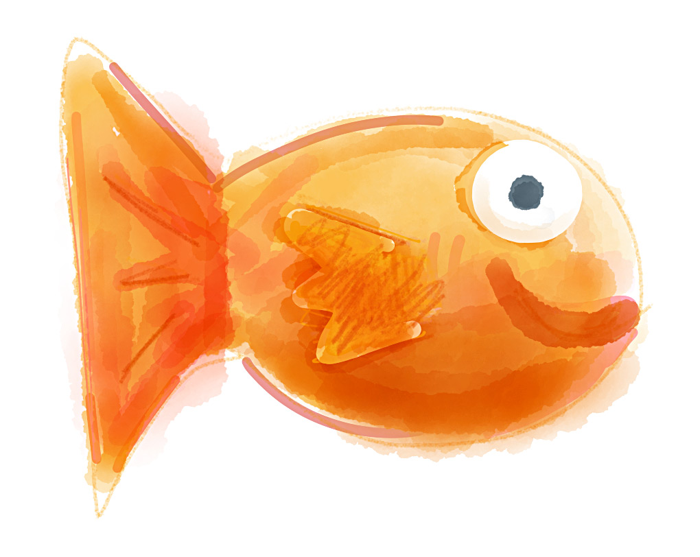
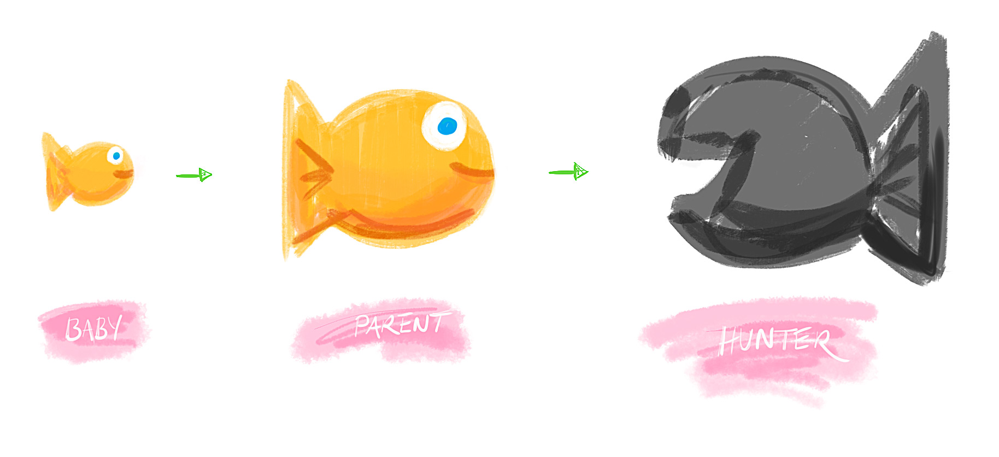
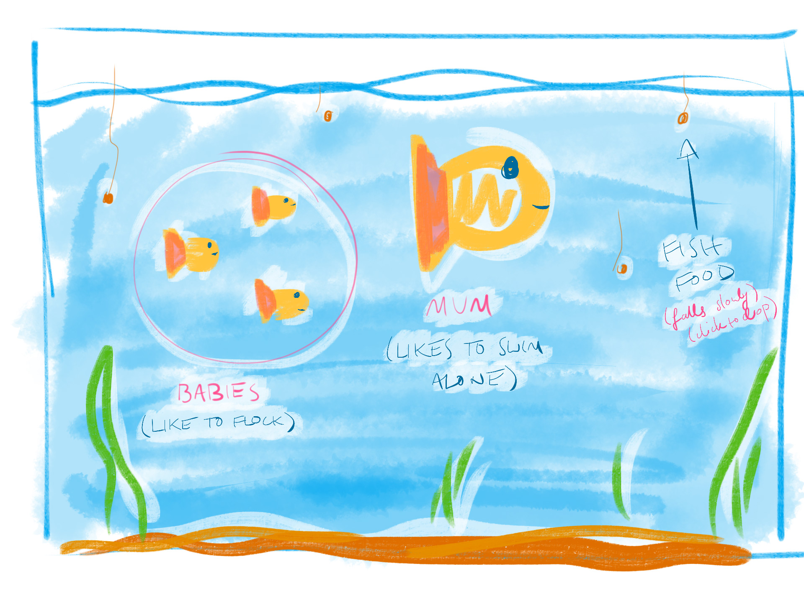

fishy
=====

A fish tank simulation/game, written as part of my AI Distinction project.

## AI Concepts Used

My project will mostly be a simulation, but the user can interact with it to a certain extent which I guess adds gamic elements.

It'll incorporate flocking/group dynamics, wandering, fleeing/hiding and hunter/prey dynamics, finite state machines, as well as some simple world rules and goal insistence that will create interesting patterns and cycles over time. 

## Elevator Pitch

A few baby fish swim in a fish tank. Baby fish like to flock. Food is dropped, and the fish race to eat the food. When they do, they grow, which makes them bigger and slower. Big fish don't like to flock as much. When they get big enough they become a parent fish, meaning they spawn a new baby fish each time they eat. Baby fish are faster though, and so steal the parent's food.

When a parent hasn't eaten in a long time, it transforms into a hunter - evil looking shark thing. Hunters roam the tank looking for fish. When enough fish are within range, they pounce. The prey flee, and try to hide in chests at the bottom of the tank. Bigger fish fill the hunter up faster, so some fish that get left out of the chest might hide behind a parent instead. Once a hunter has eaten a certain 'amount' of fish, it dies, spawning fish food (and maybe new fish if necessary).

## Detailed pitch

Imagine a fish tank, with a few baby fish swimming (**wandering**) around. From time to time food is dropped (either randomly, or by the user clicking), and it falls slowly down to the bottom of the tank. Fish love food (**goal**), and so swim towards it, particularly if they're hungry. If they get close enough they can eat it, and when they do they grow slightly. The more they eat, the bigger they get.

Little fish are quick and agile, and prefer to **flock** together. The bigger a fish gets the slower it is - more massive, less agile, and they prefer their *separation* more than flocking. Because they're slower, bigger fish have less chance to get to the food first, which gives smaller fish a chance to grow. 

When a fish grows to a certain size, they become a parent (different colour), and now each time they eat some food they spawn a new baby fish. This is somewhat undesirable, because it means there will be more smaller, faster fish to steal their food.

If a parent goes for too long without eating, it's driven mad by hunger, and transforms into a big evil shark-like creature (**hunter**) that eats other fish. Once a certain number of fish are within a certain distance (or vision) of a hunter, it can put on a burst of speed (depending on its hunger level) and attack them, eating any that touch it (stopping once they've eaten a certain amount of fish) Eg. parents are worth more than babies. 

Because smaller fish flock together, they will often be targeted by the hunter(s). There will be a panic as they all try to **flee** and disperse. The inner fish won't want to be eaten, and so will try to hide. This could mean diving into the several chests, caves etc. on the tank floor to *hide*. But, only a certain number of fish can fit inside though, and so those left out might have to do something else (like hide behind a parent so that the parent gets eaten first). Parents will also be slower, more likely to be eaten, and more likely to satiate the hunter faster.

As the hunters kills fish, there will be more food for the parents (causing fewer hunters), but that means they will also spawn more little fish (more food for hunters). A hunter has a limited life span (either time, or number of fish eaten), and so they will die off over time, bursting into fish food (and maybe spawning a few smaller fish, depending on the simulation's balance).

The cycle will repeat itself: small fish all grow fairly evenly, become parents, then their food will be taken by their children (who are now growing). The parents turn into hunters and kill their children, leaving more food for the surviving fish, who grow and spawn more. Hunters eventually die, but are replaced by new parents, whose children have starved them.

The player might be able to click to drop food in the tank, or perhaps draw a path for the hunters to follow (if we need to demonstrate more path planning stuff).

